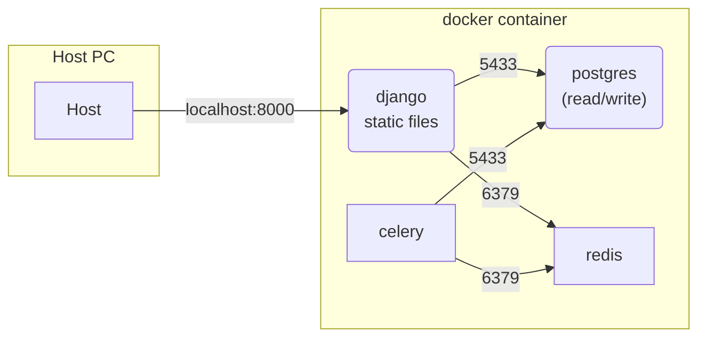
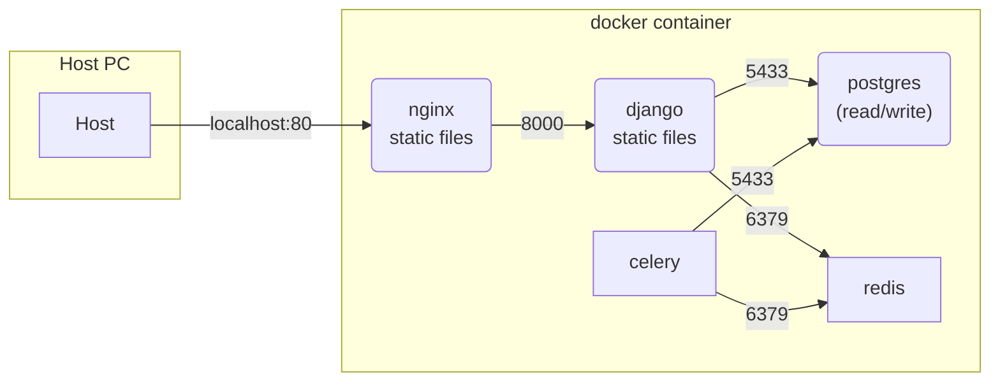

# django-rest-framework-sample

django REST framework のサンプルコード集。

以下方針にて作成。

- トリッキーなコードは書かない
- 基本的に必要になるであろう機能を実装
  - jwt による authorization
  - query parameter による filter
  - camelCase - snake_case 変換
  - celery, redis を使った非同期処理
- DRY、KISS、YAGNI を意識する
  - class base で作成
- テスト、デバッグ用のツールを development 時のみ使用
  - drf-yasg の使用
    - Open API ver2 だが、コメントから Swagger UI の説明が表現できるためこちらを使用
  - silk の使用

## docker-compose 構成

### docker-compose-dev.yml

- 開発用に auto reload
  - `python manage.py runsever` を実行
- `postgres` コンテナは、DB の writer 用 DB と reader(replica)用 DB を想定。ローカル実行では同じ DB を使用。



### docker-compose-prod.yml

- docker-compose-dev.yml に nginx を追加した構成
  - auto reload はしない
  - static file は nginx に含める



## 実行

各環境の実行想定

- production 環境設定
  - migration ファイルの作成
  - 本番用 DockerImage の作成
- development 環境設定
  - 実装

```bash
# production環境設定
# migrationファイルを作成
./run_makemigrations.sh


# development環境設定
# superuser作成. コンテナに入ってからcreatesuperuserする想定
docker-compose -f docker-compose-dev.yml run django-dev /bin/bash
python manage.py createsuperuser


# development環境設定
# runserverを実行
docker-compose -f docker-compose-dev.yml up


# production環境設定
# production用イメージ作成
# 引数なしの場合、イメージ名:タグは django:latest
# 引数としてイメージ名、タグが指定可能
./run_build_image.sh
```

## テスト

```bash
# django/src/htmlcov にカバレッジ等の情報が出力される
./run_test.sh
```

### Dockerfile

- [hadolint](https://github.com/hadolint/hadolint)
- [dockle](https://github.com/goodwithtech/dockle)

```bash
# Dockerfileに対するlint
hadolint Dockerfile

# DockerImageに対するセキュリティ等確認
# pip module用にsettings.pyは除外
docker build . -t test
dockle -af settings.py test
```
